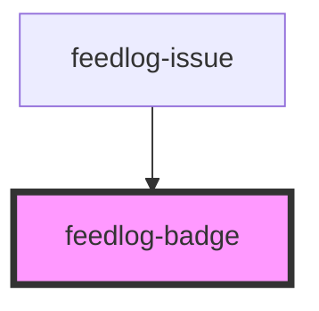

# feedlog-badge

## Styling

`--feedlog-badge-*` and variant colors (`--feedlog-blue-*`, `--feedlog-red-*`, `--feedlog-muted-*`) are defined on `:host` in [`feedlog-badge.css`](./feedlog-badge.css); override from a parent such as `feedlog-issues` or `feedlog-issues-client`. See [Customize Feedlog styling](../../../../../docs/CUSTOMIZE_FEEDLOG_STYLING.md).

<!-- Auto Generated Below -->

## Overview

Feedlog Badge Component

A label component with variant support for different styles.

## Properties

| Property  | Attribute | Description         | Type                                                         | Default     |
| --------- | --------- | ------------------- | ------------------------------------------------------------ | ----------- |
| `variant` | `variant` | Badge variant style | `"default" \| "destructive" \| "enhancement" \| "secondary"` | `'default'` |

## Dependencies

### Used by

- [feedlog-issue](../feedlog-issue)

### Graph

```mermaid
graph TD;
  feedlog-issue --> feedlog-badge
  style feedlog-badge fill:#f9f,stroke:#333,stroke-width:4px
```

---

_Built with [StencilJS](https://stenciljs.com/)_
