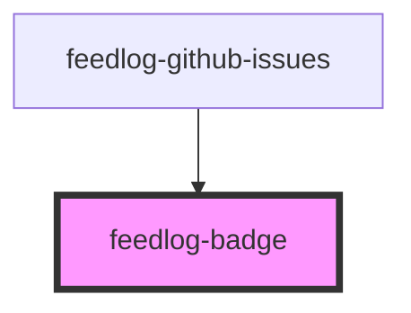

# feedlog-badge

<!-- Auto Generated Below -->

## Overview

Feedlog Badge Component

A label component with variant support for different styles.

## Properties

| Property  | Attribute | Description         | Type                         | Default     |
| --------- | --------- | ------------------- | ---------------------------- | ----------- |
| `variant` | `variant` | Badge variant style | `"default" \| "destructive"` | `'default'` |

## Dependencies

### Used by

 - [feedlog-github-issues](../feedlog-github-issues)

### Graph

----------------------------------------------

*Built with [StencilJS](https://stenciljs.com/)*
