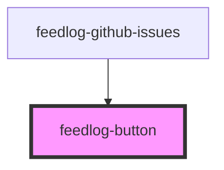

# feedlog-button

<!-- Auto Generated Below -->

## Overview

Feedlog Button Component

A button component with variant and size support.

## Properties

| Property   | Attribute  | Description          | Type                                                 | Default     |
| ---------- | ---------- | -------------------- | ---------------------------------------------------- | ----------- |
| `disabled` | `disabled` | Disabled state       | `boolean`                                            | `false`     |
| `size`     | `size`     | Button size          | `"default" \| "lg" \| "sm"`                          | `'default'` |
| `type`     | `type`     | Button type          | `"button" \| "reset" \| "submit"`                    | `'button'`  |
| `variant`  | `variant`  | Button variant style | `"default" \| "destructive" \| "ghost" \| "outline"` | `'default'` |

## Events

| Event          | Description                          | Type                      |
| -------------- | ------------------------------------ | ------------------------- |
| `feedlogClick` | Event emitted when button is clicked | `CustomEvent<MouseEvent>` |

## Dependencies

### Used by

 - [feedlog-github-issues](../feedlog-github-issues)

### Graph

----------------------------------------------

*Built with [StencilJS](https://stenciljs.com/)*
