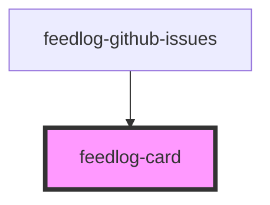

# feedlog-card

<!-- Auto Generated Below -->

## Overview

Feedlog Card Component

A reusable card container component with header and content areas.

## Dependencies

### Used by

 - [feedlog-github-issues](../feedlog-github-issues)

### Graph

----------------------------------------------

*Built with [StencilJS](https://stenciljs.com/)*
