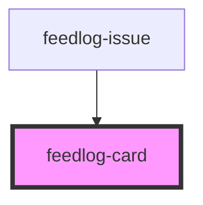

# feedlog-card

Named slots: optional `header-meta` (top row, e.g. badges and date), `header` (title row alongside the collapsible chevron when `collapsible`), `content`, and `footer`. Styling uses [`feedlog-card.css`](./feedlog-card.css); parent themes can set `--feedlog-*` where shared with other Feedlog components.

<!-- Auto Generated Below -->

## Properties

| Property      | Attribute     | Description                                                                                       | Type      | Default |
| ------------- | ------------- | ------------------------------------------------------------------------------------------------- | --------- | ------- |
| `collapsible` | `collapsible` | When true, header toggles collapsing the content slot; footer stays visible. Default off.         | `boolean` | `false` |
| `embed`       | `embed`       | Flat surface (no inner card border/shadow) for nesting inside another shell (e.g. feedlog-issue). | `boolean` | `false` |

## Dependencies

### Used by

- [feedlog-issue](../feedlog-issue)

### Graph

```mermaid
graph TD;
  feedlog-issue --> feedlog-card
  style feedlog-card fill:#f9f,stroke:#333,stroke-width:4px
```

---

_Built with [StencilJS](https://stenciljs.com/)_
