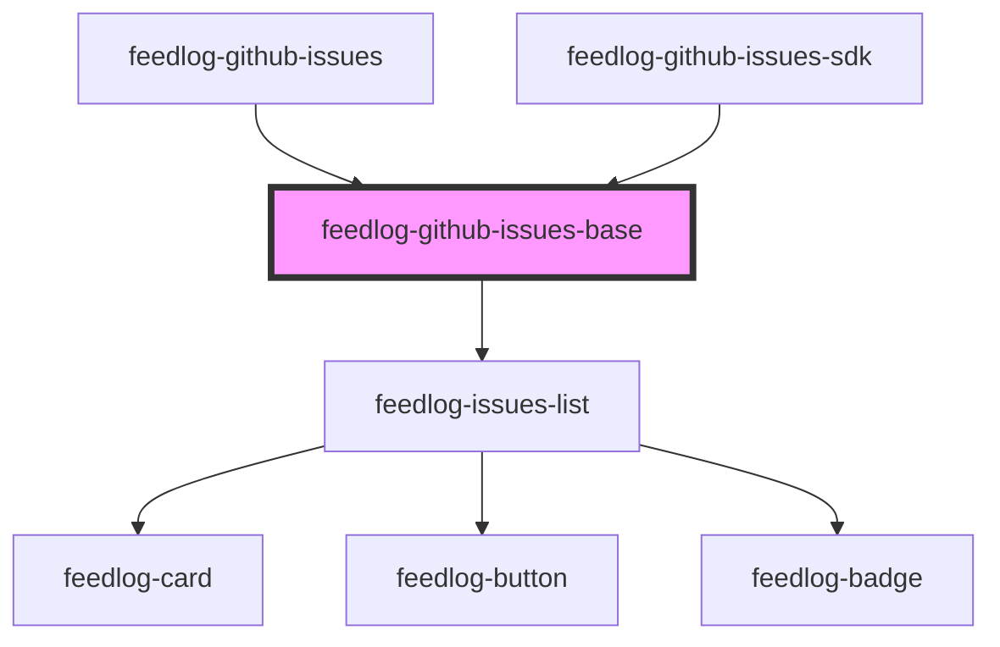

# feedlog-github-issues-base

<!-- Auto Generated Below -->

## Overview

Feedlog GitHub Issues Base Component

Shared base component for displaying GitHub issues with support for bugs and enhancements.
This component handles the UI rendering and delegates to feedlog-issues-list for the actual list.

## Properties

| Property   | Attribute   | Description                                       | Type                | Default   |
| ---------- | ----------- | ------------------------------------------------- | ------------------- | --------- |
| `error`    | `error`     | Error message - shows error state when set        | `null \| string`    | `null`    |
| `issues`   | --          | Array of issues to display                        | `GitHubIssue[]`     | `[]`      |
| `loading`  | `loading`   | Loading state - shows loading indicator when true | `boolean`           | `false`   |
| `maxWidth` | `max-width` | Maximum width of the container                    | `string`            | `'56rem'` |
| `theme`    | `theme`     | Theme variant: 'light' or 'dark'                  | `"dark" \| "light"` | `'light'` |

## Events

| Event           | Description                            | Type                  |
| --------------- | -------------------------------------- | --------------------- |
| `feedlogUpvote` | Event emitted when an issue is upvoted | `CustomEvent<number>` |

## Dependencies

### Used by

 - [feedlog-github-issues](../feedlog-github-issues)
 - [feedlog-github-issues-sdk](../feedlog-github-issues-sdk)

### Depends on

- [feedlog-issues-list](../feedlog-issues-list)

### Graph

----------------------------------------------

*Built with [StencilJS](https://stenciljs.com/)*
