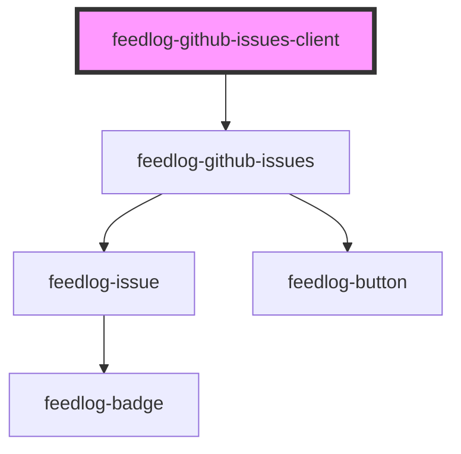

# feedlog-github-issues-client

<!-- Auto Generated Below -->

## Overview

Feedlog GitHub Issues Client Component

A component for displaying GitHub issues fetched using the Feedlog SDK.
This component uses the SDK internally to fetch data and delegates to feedlog-github-issues for rendering.

## Properties

| Property              | Attribute   | Description                                                                                                                                                | Type                                                                  | Default     |
| --------------------- | ----------- | ---------------------------------------------------------------------------------------------------------------------------------------------------------- | --------------------------------------------------------------------- | ----------- |
| `apiKey` _(required)_ | `api-key`   | API key for Feedlog authentication (required) The API key determines which repositories' issues are fetched                                                | `string`                                                              | `undefined` |
| `endpoint`            | `endpoint`  | Custom API endpoint                                                                                                                                        | `string \| undefined`                                                 | `undefined` |
| `getIssueUrl`         | --          | Optional callback to resolve GitHub issue URL when githubIssueNumber is available. Required because repository.owner was removed from the API for privacy. | `((issue: FeedlogIssue) => string \| null \| undefined) \| undefined` | `undefined` |
| `heading`             | `heading`   | Custom heading for the issues section                                                                                                                      | `string \| undefined`                                                 | `undefined` |
| `limit`               | `limit`     | Maximum number of issues to fetch (1-100, default 10)                                                                                                      | `number \| undefined`                                                 | `undefined` |
| `maxWidth`            | `max-width` | Maximum width of the container                                                                                                                             | `string`                                                              | `'42rem'`   |
| `sortBy`              | `sort-by`   | Sort issues by field: 'createdAt' or 'updatedAt'                                                                                                           | `"createdAt" \| "updatedAt" \| undefined`                             | `undefined` |
| `subtitle`            | `subtitle`  | Custom subtitle for the issues section                                                                                                                     | `string \| undefined`                                                 | `undefined` |
| `theme`               | `theme`     | Theme variant: 'light' or 'dark'                                                                                                                           | `"dark" \| "light"`                                                   | `'light'`   |
| `type`                | `type`      | Filter issues by type: 'bug' or 'enhancement'                                                                                                              | `"bug" \| "enhancement" \| undefined`                                 | `undefined` |

## Events

| Event           | Description                            | Type                                                                       |
| --------------- | -------------------------------------- | -------------------------------------------------------------------------- |
| `feedlogError`  | Event emitted on error                 | `CustomEvent<{ error: string; code?: number \| undefined; }>`              |
| `feedlogUpvote` | Event emitted when an issue is upvoted | `CustomEvent<{ issueId: string; upvoted: boolean; upvoteCount: number; }>` |

## Dependencies

### Depends on

- [feedlog-github-issues](../feedlog-github-issues)

### Graph

---

_Built with [StencilJS](https://stenciljs.com/)_
