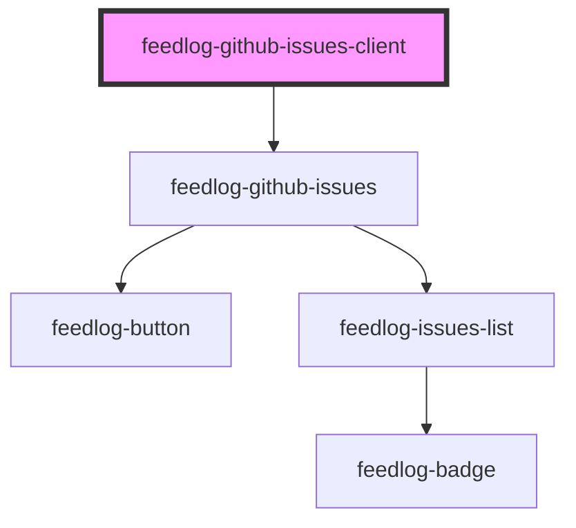

# feedlog-github-issues-client

<!-- Auto Generated Below -->

## Overview

Feedlog GitHub Issues Client Component

A component for displaying GitHub issues fetched using the Feedlog SDK.
This component uses the SDK internally to fetch data and delegates to feedlog-github-issues for rendering.

## Properties

| Property          | Attribute           | Description                                                                               | Type                                  | Default     |
| ----------------- | ------------------- | ----------------------------------------------------------------------------------------- | ------------------------------------- | ----------- |
| `endpoint`        | `endpoint`          | Custom API endpoint                                                                       | `string \| undefined`                 | `undefined` |
| `limit`           | `limit`             | Maximum number of issues to fetch (1-100, default 10)                                     | `number \| undefined`                 | `undefined` |
| `maxWidth`        | `max-width`         | Maximum width of the container                                                            | `string`                              | `'42rem'`   |
| `repos`           | `repos`             | Array of repository public IDs or single ID Format: repository public ID (not owner/repo) | `string \| string[] \| undefined`     | `undefined` |
| `showThemeToggle` | `show-theme-toggle` | Whether to show the theme toggle button                                                   | `boolean`                             | `true`      |
| `theme`           | `theme`             | Theme variant: 'light' or 'dark'                                                          | `"dark" \| "light"`                   | `'light'`   |
| `type`            | `type`              | Filter issues by type: 'bug' or 'enhancement'                                             | `"bug" \| "enhancement" \| undefined` | `undefined` |

## Events

| Event                | Description                            | Type                                                                       |
| -------------------- | -------------------------------------- | -------------------------------------------------------------------------- |
| `feedlogError`       | Event emitted on error                 | `CustomEvent<{ error: string; code?: number \| undefined; }>`              |
| `feedlogThemeChange` | Event emitted when theme changes       | `CustomEvent<"dark" \| "light">`                                           |
| `feedlogUpvote`      | Event emitted when an issue is upvoted | `CustomEvent<{ issueId: string; upvoted: boolean; upvoteCount: number; }>` |

## Dependencies

### Depends on

- [feedlog-github-issues](../feedlog-github-issues)

### Graph

---

_Built with [StencilJS](https://stenciljs.com/)_
