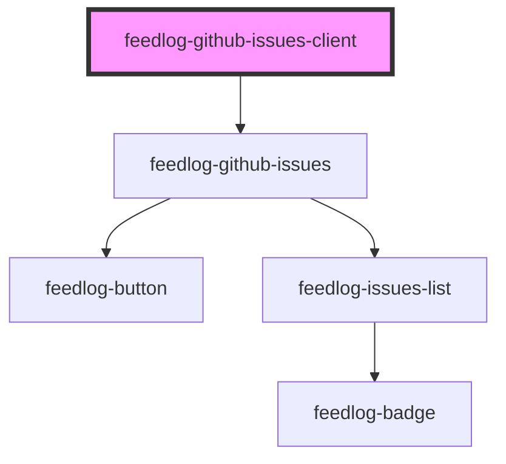

# feedlog-github-issues-client

<!-- Auto Generated Below -->

## Overview

Feedlog GitHub Issues Client Component

A component for displaying GitHub issues fetched using the Feedlog SDK.
This component uses the SDK internally to fetch data and delegates to feedlog-github-issues for rendering.

## Properties

| Property          | Attribute           | Description                                                   | Type                              | Default     |
| ----------------- | ------------------- | ------------------------------------------------------------- | --------------------------------- | ----------- |
| `maxWidth`        | `max-width`         | Maximum width of the container                                | `string`                          | `'42rem'`   |
| `pk` _(required)_ | `pk`                | API key (public key) for the Feedlog SDK                      | `string`                          | `undefined` |
| `repos`           | `repos`             | Array of repository IDs (e.g., ['owner/repo']) or JSON string | `string \| string[] \| undefined` | `undefined` |
| `showThemeToggle` | `show-theme-toggle` | Whether to show the theme toggle button                       | `boolean`                         | `true`      |
| `theme`           | `theme`             | Theme variant: 'light' or 'dark'                              | `"dark" \| "light"`               | `'light'`   |

## Events

| Event                | Description                            | Type                             |
| -------------------- | -------------------------------------- | -------------------------------- |
| `feedlogThemeChange` | Event emitted when theme changes       | `CustomEvent<"dark" \| "light">` |
| `feedlogUpvote`      | Event emitted when an issue is upvoted | `CustomEvent<number>`            |

## Dependencies

### Depends on

- [feedlog-github-issues](../feedlog-github-issues)

### Graph

----------------------------------------------

*Built with [StencilJS](https://stenciljs.com/)*
