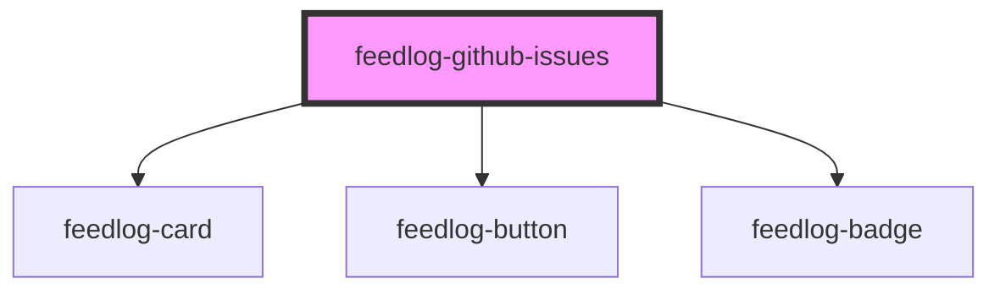

# feedlog-github-issues

<!-- Auto Generated Below -->

## Overview

Feedlog GitHub Issues Component

A component for displaying a list of GitHub issues with support for bugs and enhancements.

## Properties

| Property   | Attribute   | Description                         | Type                                   | Default     |
| ---------- | ----------- | ----------------------------------- | -------------------------------------- | ----------- |
| `data`     | `data`      | Issues data as JSON string or array | `GitHubIssue[] \| string \| undefined` | `undefined` |
| `maxWidth` | `max-width` | Maximum width of the container      | `string`                               | `'56rem'`   |

## Events

| Event           | Description                            | Type                  |
| --------------- | -------------------------------------- | --------------------- |
| `feedlogUpvote` | Event emitted when an issue is upvoted | `CustomEvent<number>` |

## Dependencies

### Depends on

- [feedlog-card](../feedlog-card)
- [feedlog-button](../feedlog-button)
- [feedlog-badge](../feedlog-badge)

### Graph

----------------------------------------------

*Built with [StencilJS](https://stenciljs.com/)*
