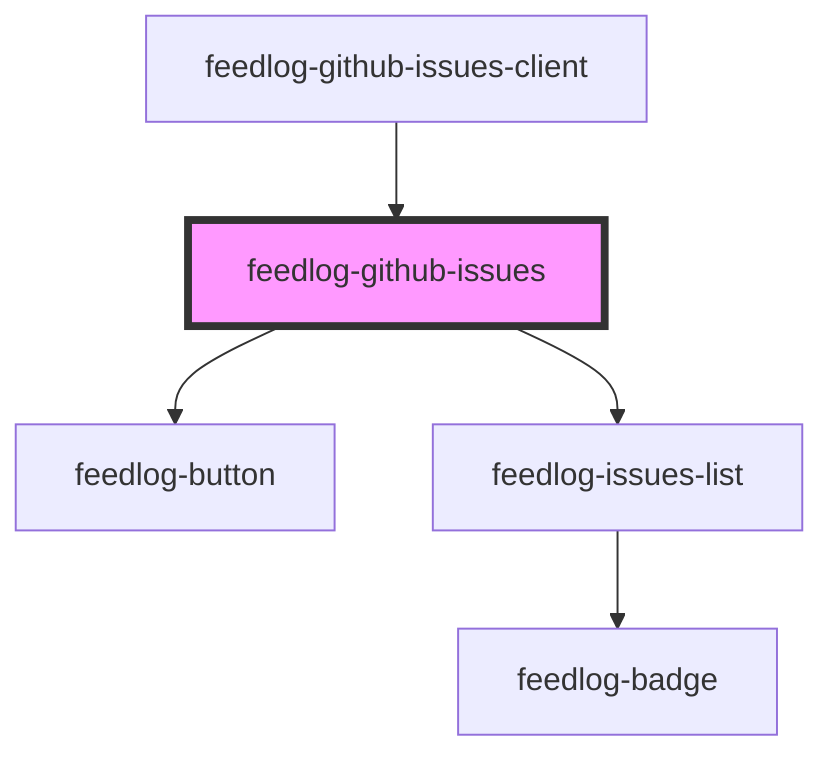

# feedlog-github-issues

<!-- Auto Generated Below -->

## Overview

Feedlog GitHub Issues Component

Component for displaying GitHub issues with support for bugs and enhancements.
This component handles the UI rendering and delegates to feedlog-issues-list for the actual list.

## Properties

| Property          | Attribute           | Description                                       | Type                | Default   |
| ----------------- | ------------------- | ------------------------------------------------- | ------------------- | --------- |
| `error`           | `error`             | Error message - shows error state when set        | `null \| string`    | `null`    |
| `hasMore`         | `has-more`          | Whether there are more issues to load             | `boolean`           | `false`   |
| `isLoadingMore`   | `is-loading-more`   | Whether more issues are currently loading         | `boolean`           | `false`   |
| `issues`          | --                  | Array of issues to display                        | `FeedlogIssue[]`    | `[]`      |
| `loading`         | `loading`           | Loading state - shows loading indicator when true | `boolean`           | `false`   |
| `maxWidth`        | `max-width`         | Maximum width of the container                    | `string`            | `'42rem'` |
| `showThemeToggle` | `show-theme-toggle` | Whether to show the theme toggle button           | `boolean`           | `true`    |
| `theme`           | `theme`             | Theme variant: 'light' or 'dark'                  | `"dark" \| "light"` | `'light'` |

## Events

| Event                | Description                            | Type                                                                               |
| -------------------- | -------------------------------------- | ---------------------------------------------------------------------------------- |
| `feedlogLoadMore`    | Event emitted to load more issues      | `CustomEvent<void>`                                                                |
| `feedlogThemeChange` | Event emitted when theme changes       | `CustomEvent<"dark" \| "light">`                                                   |
| `feedlogUpvote`      | Event emitted when an issue is upvoted | `CustomEvent<{ issueId: string; currentUpvoted: boolean; currentCount: number; }>` |

## Dependencies

### Used by

 - [feedlog-github-issues-client](../feedlog-github-issues-client)

### Depends on

- [feedlog-button](../feedlog-button)
- [feedlog-issues-list](../feedlog-issues-list)

### Graph

----------------------------------------------

*Built with [StencilJS](https://stenciljs.com/)*
