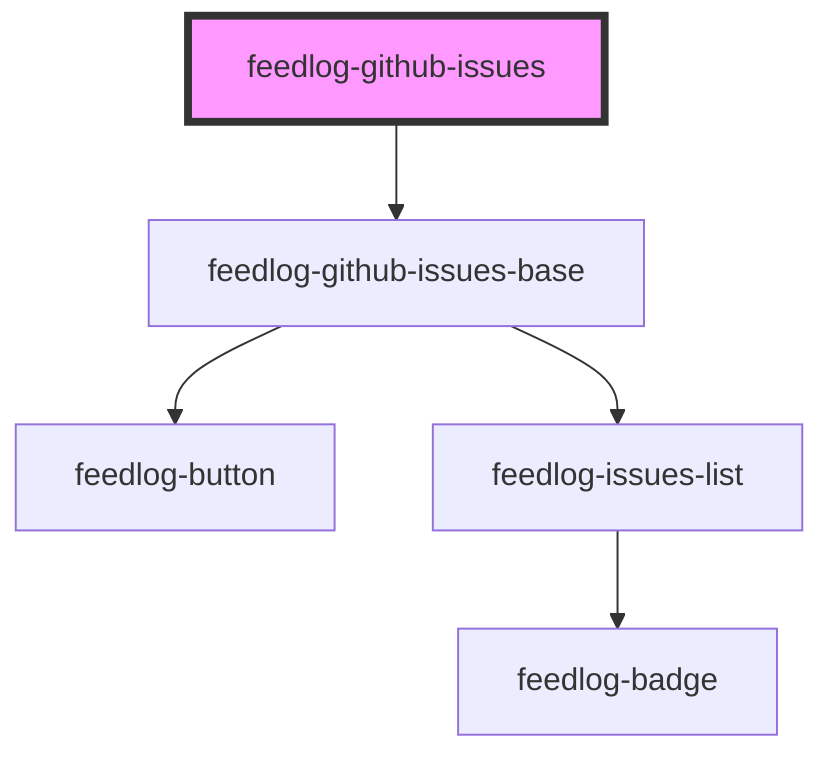

# feedlog-github-issues

<!-- Auto Generated Below -->

## Overview

Feedlog GitHub Issues Component

A component for displaying a list of GitHub issues with support for bugs and enhancements.
This component accepts data directly and delegates to the base component for rendering.

## Properties

| Property          | Attribute           | Description                             | Type                                   | Default     |
| ----------------- | ------------------- | --------------------------------------- | -------------------------------------- | ----------- |
| `data`            | `data`              | Issues data as JSON string or array     | `GitHubIssue[] \| string \| undefined` | `undefined` |
| `maxWidth`        | `max-width`         | Maximum width of the container          | `string`                               | `'42rem'`   |
| `showThemeToggle` | `show-theme-toggle` | Whether to show the theme toggle button | `boolean`                              | `true`      |
| `theme`           | `theme`             | Theme variant: 'light' or 'dark'        | `"dark" \| "light"`                    | `'light'`   |

## Events

| Event                | Description                            | Type                             |
| -------------------- | -------------------------------------- | -------------------------------- |
| `feedlogThemeChange` | Event emitted when theme changes       | `CustomEvent<"dark" \| "light">` |
| `feedlogUpvote`      | Event emitted when an issue is upvoted | `CustomEvent<number>`            |

## Dependencies

### Depends on

- [feedlog-github-issues-base](../feedlog-github-issues-base)

### Graph

----------------------------------------------

*Built with [StencilJS](https://stenciljs.com/)*
