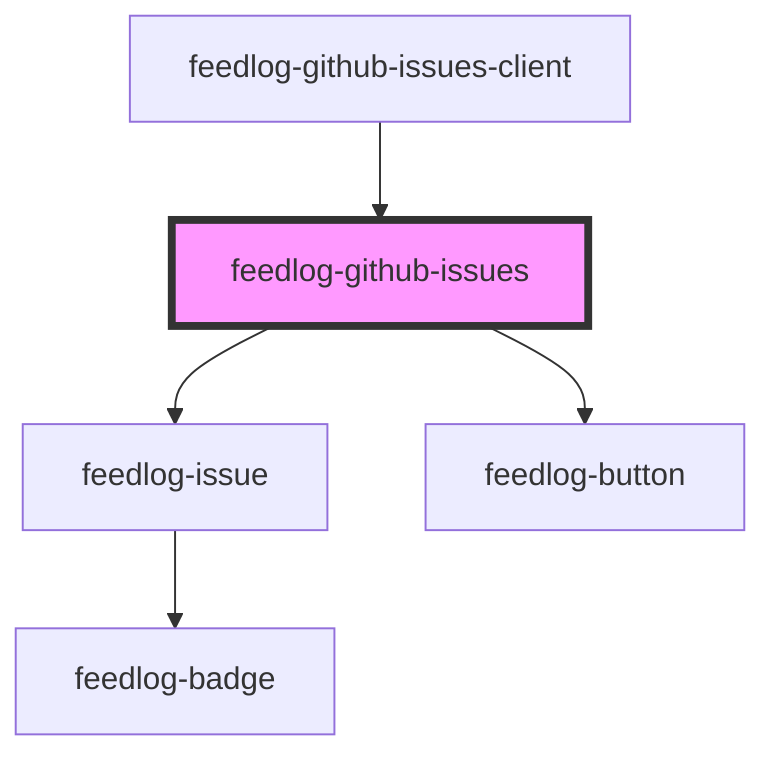

# feedlog-github-issues

<!-- Auto Generated Below -->

## Overview

Feedlog GitHub Issues Component

Component for displaying GitHub issues with support for bugs and enhancements.
Includes full list rendering, loading/error states, and pagination support.

## Properties

| Property        | Attribute         | Description                                                                                                                                                  | Type                                                                  | Default     |
| --------------- | ----------------- | ------------------------------------------------------------------------------------------------------------------------------------------------------------ | --------------------------------------------------------------------- | ----------- |
| `error`         | `error`           | Error message - shows error state when set                                                                                                                   | `null \| string`                                                      | `null`      |
| `getIssueUrl`   | --                | Optional callback to resolve GitHub issue URL when githubIssueLink is not available. Required because repository.owner was removed from the API for privacy. | `((issue: FeedlogIssue) => string \| null \| undefined) \| undefined` | `undefined` |
| `hasMore`       | `has-more`        | Whether there are more issues to load                                                                                                                        | `boolean`                                                             | `false`     |
| `heading`       | `heading`         | Custom heading for the issues section                                                                                                                        | `string \| undefined`                                                 | `undefined` |
| `isLoadingMore` | `is-loading-more` | Whether more issues are currently loading                                                                                                                    | `boolean`                                                             | `false`     |
| `issues`        | --                | Array of issues to display                                                                                                                                   | `FeedlogIssue[]`                                                      | `[]`        |
| `loading`       | `loading`         | Loading state - shows loading indicator when true                                                                                                            | `boolean`                                                             | `false`     |
| `maxWidth`      | `max-width`       | Maximum width of the container                                                                                                                               | `string`                                                              | `'42rem'`   |
| `subtitle`      | `subtitle`        | Custom subtitle for the issues section                                                                                                                       | `string \| undefined`                                                 | `undefined` |
| `theme`         | `theme`           | Theme variant: 'light' or 'dark'                                                                                                                             | `"dark" \| "light"`                                                   | `'light'`   |

## Events

| Event             | Description                                         | Type                                                                               |
| ----------------- | --------------------------------------------------- | ---------------------------------------------------------------------------------- |
| `feedlogLoadMore` | Event emitted to load more issues                   | `CustomEvent<void>`                                                                |
| `feedlogRetry`    | Event emitted when user clicks retry in error state | `CustomEvent<void>`                                                                |
| `feedlogUpvote`   | Event emitted when an issue is upvoted              | `CustomEvent<{ issueId: string; currentUpvoted: boolean; currentCount: number; }>` |

## Dependencies

### Used by

- [feedlog-github-issues-client](../feedlog-github-issues-client)

### Depends on

- [feedlog-issue](../feedlog-issue)
- [feedlog-button](../feedlog-button)

### Graph

---

_Built with [StencilJS](https://stenciljs.com/)_
