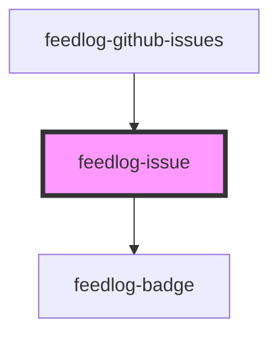

# feedlog-issue

A component for displaying a single GitHub issue with support for bugs and enhancements.

<!-- Auto Generated Below -->

## Overview

Feedlog Issue Component

A component for displaying a single GitHub issue.

## Properties

| Property             | Attribute | Description                      | Type                | Default     |
| -------------------- | --------- | -------------------------------- | ------------------- | ----------- |
| `issue` _(required)_ | --        | The issue to display             | `FeedlogIssue`      | `undefined` |
| `theme`              | `theme`   | Theme variant: 'light' or 'dark' | `"dark" \| "light"` | `'light'`   |

## Events

| Event           | Description                             | Type                                                                               |
| --------------- | --------------------------------------- | ---------------------------------------------------------------------------------- |
| `feedlogUpvote` | Event emitted when the issue is upvoted | `CustomEvent<{ issueId: string; currentUpvoted: boolean; currentCount: number; }>` |

## Dependencies

### Used by

 - [feedlog-github-issues](../feedlog-github-issues)

### Depends on

- [feedlog-badge](../feedlog-badge)

### Graph

----------------------------------------------

*Built with [StencilJS](https://stenciljs.com/)*
