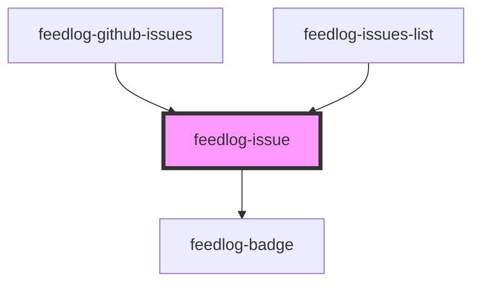

# feedlog-issue

A component for displaying a single GitHub issue with support for bugs and enhancements.

## CSS Customization

You can customize the appearance by setting CSS variables on the `feedlog-issue` element:

```css
feedlog-issue {
  /* Card */
  --feedlog-card-padding: 1.25rem;
  --feedlog-card-accent-width: 3px;
  --feedlog-radius: 0.625rem;
  --feedlog-shadow: 0 1px 3px 0 rgba(0, 0, 0, 0.08);
  --feedlog-shadow-hover: 0 4px 12px -2px rgba(0, 0, 0, 0.1);

  /* Typography */
  --feedlog-title-font-size: 0.9375rem;
  --feedlog-title-font-weight: 600;
  --feedlog-body-font-size: 0.8125rem;
  --feedlog-body-line-height: 1.5;
  --feedlog-timestamp-font-size: 0.6875rem;
  --feedlog-timestamp-color: var(--feedlog-muted-foreground);

  /* Colors (inherited from theme) */
  --feedlog-card: #ffffff;
  --feedlog-card-foreground: oklch(0.145 0 0);
  --feedlog-muted: #f1f5f9;
  --feedlog-muted-foreground: #64748b;
  --feedlog-border: rgba(0, 0, 0, 0.08);
  --feedlog-accent-color: #2563eb;
  --feedlog-destructive: #d4183d;
  --feedlog-icon-color: var(--feedlog-muted-foreground);
  --feedlog-pin-color: var(--feedlog-accent-color);
  --feedlog-upvote-icon-color: var(--feedlog-blue-600);
  --feedlog-upvote-icon-filled-color: var(--feedlog-red-600);
}
```

### Custom upvote icon

Replace the default thumbs-up icon with a custom icon using the `upvote-icon` slot:

```html
<feedlog-issue issue="{myIssue}">
  <svg slot="upvote-icon" viewBox="0 0 24 24" width="16" height="16">
    <!-- your custom icon -->
  </svg>
</feedlog-issue>
```

Style the icon based on upvote state using the `data-upvoted` attribute on the host:

```css
feedlog-issue[data-upvoted='true'] [slot='upvote-icon'] {
  fill: var(--your-upvoted-color);
}
```

<!-- Auto Generated Below -->

## Overview

Feedlog Issue Component

A component for displaying a single GitHub issue.

## Properties

| Property             | Attribute   | Description                                                                                                                                                            | Type                          | Default     |
| -------------------- | ----------- | ---------------------------------------------------------------------------------------------------------------------------------------------------------------------- | ----------------------------- | ----------- |
| `issue` _(required)_ | --          | The issue to display                                                                                                                                                   | `FeedlogIssue`                | `undefined` |
| `issueUrl`           | `issue-url` | Optional URL for the GitHub issue. When provided along with githubIssueLink, shows a "View on GitHub" button. Required because owner is no longer in the API response. | `null \| string \| undefined` | `undefined` |
| `theme`              | `theme`     | Theme variant: 'light' or 'dark'                                                                                                                                       | `"dark" \| "light"`           | `'light'`   |

## Events

| Event           | Description                             | Type                                                                               |
| --------------- | --------------------------------------- | ---------------------------------------------------------------------------------- |
| `feedlogUpvote` | Event emitted when the issue is upvoted | `CustomEvent<{ issueId: string; currentUpvoted: boolean; currentCount: number; }>` |

## Shadow Parts

| Part              | Description |
| ----------------- | ----------- |
| `"github-link"`   |             |
| `"upvote-button"` |             |

## Dependencies

### Used by

- [feedlog-github-issues](../feedlog-github-issues)
- [feedlog-issues-list](../feedlog-issues-list)

### Depends on

- [feedlog-badge](../feedlog-badge)

### Graph



---

_Built with [StencilJS](https://stenciljs.com/)_
