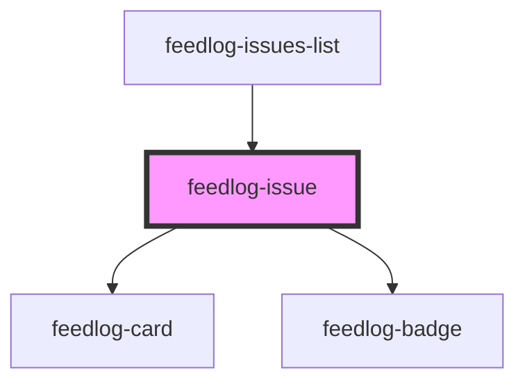

# feedlog-issue

A component for displaying a single GitHub issue with support for bugs and enhancements.

## CSS Customization

You can customize the appearance by setting CSS variables on the `feedlog-issue` element (or on a parent such as `feedlog-issues` / `feedlog-issues-client` when inheritance applies):

```css
feedlog-issue {
  /* Card */
  --feedlog-card-padding: 1.25rem;
  --feedlog-card-radius: 0.75rem;
  --feedlog-radius: 0.625rem;
  --feedlog-shadow:
    0 1px 2px rgba(0, 0, 0, 0.04), 0 4px 12px rgba(0, 0, 0, 0.06),
    inset 0 1px 0 rgba(255, 255, 255, 0.5);
  --feedlog-shadow-hover-enhancement:
    0 8px 16px rgba(37, 99, 235, 0.08), 0 12px 24px rgba(37, 99, 235, 0.05),
    inset 0 1px 0 rgba(255, 255, 255, 0.6);
  --feedlog-shadow-hover-bug:
    0 8px 16px rgba(212, 24, 61, 0.08), 0 12px 24px rgba(212, 24, 61, 0.05),
    inset 0 1px 0 rgba(255, 255, 255, 0.6);

  /* Typography */
  --feedlog-font-family: system-ui, sans-serif;
  --feedlog-title-font-family: 'Georgia', serif;
  --feedlog-title-font-size: 1.125rem;
  --feedlog-title-font-weight: 600;
  --feedlog-title-line-height: 1.3;
  --feedlog-title-margin-bottom: 0.75rem;
  --feedlog-title-letter-spacing: -0.02em;
  --feedlog-body-font-size: 0.875rem;
  --feedlog-body-line-height: 1.6;
  --feedlog-timestamp-font-size: 0.6875rem;
  --feedlog-timestamp-color: var(--feedlog-muted-foreground);

  /* Card chrome */
  --feedlog-card-accent-height: 3px;
  --feedlog-card-accent-opacity: 0.85;
  --feedlog-card-hover-translate-y: 0;
  --feedlog-content-gap: 0.875rem;
  --feedlog-footer-padding-top: 1.25rem;
  --feedlog-header-margin-bottom: 0.875rem;
  --feedlog-title-underline-width: 3rem;
  --feedlog-title-underline-height: 2px;
  --feedlog-title-underline-offset: -4px;
  --feedlog-title-underline-radius: 2px;
  --feedlog-card-padding-mobile: 1rem;
  --feedlog-content-gap-mobile: 0.75rem;
  --feedlog-title-font-size-mobile: 1.25rem;

  /* Optional: replace the entire top accent bar gradient */
  --feedlog-card-accent-gradient-enhancement: linear-gradient(
    90deg,
    var(--feedlog-blue-400),
    var(--feedlog-accent-color),
    var(--feedlog-blue-600)
  );
  --feedlog-card-accent-gradient-bug: linear-gradient(
    90deg,
    var(--feedlog-red-600),
    var(--feedlog-destructive),
    var(--feedlog-red-600)
  );

  /* Upvote pill (light defaults; dark theme overrides these on :host(.dark)) */
  --feedlog-upvote-bg: linear-gradient(
    180deg,
    rgba(255, 255, 255, 0.8) 0%,
    rgba(248, 250, 252, 0.8) 100%
  );
  --feedlog-upvote-bg-hover: linear-gradient(
    180deg,
    rgba(248, 250, 252, 0.9) 0%,
    rgba(241, 245, 249, 0.9) 100%
  );
  --feedlog-upvote-border: rgba(226, 232, 240, 0.8);
  --feedlog-upvote-border-hover: #cbd5e1;
  --feedlog-upvote-shadow: 0 2px 4px rgba(0, 0, 0, 0.02), inset 0 1px 0 rgba(255, 255, 255, 1);
  --feedlog-upvote-shadow-hover:
    0 8px 16px -4px rgba(0, 0, 0, 0.05), 0 4px 8px -2px rgba(0, 0, 0, 0.02),
    inset 0 1px 0 rgba(255, 255, 255, 1);
  --feedlog-upvote-text: #475569;
  --feedlog-upvote-text-hover: #0f172a;
  --feedlog-upvote-upvoted-bg: linear-gradient(180deg, #eff6ff 0%, #e0e7ff 100%);
  --feedlog-upvote-upvoted-border: #bfdbfe;
  --feedlog-upvote-upvoted-text: #2563eb;
  --feedlog-upvote-reel-border: #e2e8f0;
  --feedlog-upvote-hover-lift: -2px;
  --feedlog-upvote-backdrop-blur: 8px;

  /* Colors (inherited from theme) */
  --feedlog-card: #ffffff;
  --feedlog-card-foreground: oklch(0.145 0 0);
  --feedlog-muted: #f1f5f9;
  --feedlog-muted-foreground: #64748b;
  --feedlog-border: rgba(0, 0, 0, 0.08);
  --feedlog-accent-color: #2563eb;
  --feedlog-destructive: #d4183d;
  --feedlog-icon-color: var(--feedlog-muted-foreground);
  --feedlog-pin-color: var(--feedlog-accent-color);
  --feedlog-upvote-icon-color: var(--feedlog-blue-600);
  --feedlog-upvote-icon-filled-color: var(--feedlog-red-600);
}
```

### What you can customize with CSS variables

Any `--feedlog-*` token declared on the component’s `:host` in `feedlog-issue.css` can be overridden from the outside by setting the same name on `feedlog-issue` (or a parent, when the cascade applies). That includes theme colors, radii, shadows, padding, typography, the top accent bar (height, opacity, or full gradient via `--feedlog-card-accent-gradient-*`), card hover lift, content/footer spacing, title underline, mobile padding/gap/title size, and the upvote control backgrounds, borders, shadows, and text colors.

### What you cannot customize with CSS variables alone

- **DOM and structure:** Markdown output inside the body (headings, lists, blockquotes), which slots exist, and whether the footer or upvote row appears.
- **SVG metrics in the component source:** Default pin/upvote icon sizes, `viewBox`, and stroke width (change via **slots**—e.g. `upvote-icon`—or a future prop).
- **Behavior:** `feedlogUpvote` payload, `theme` prop handling, issue type → enhancement vs bug styling class.
- **Shadow piercing:** External stylesheets cannot target internal class names. Use **CSS variables on the host**, **`::part`** (`github-link`, `media`, `upvote-button`), or **slots** (`media`, `upvote-icon`).
- **Values never wired to `var()`:** Anything still literal in the stylesheet cannot be themed until a matching `--feedlog-*` is added in component CSS.

### Making something new customizable

Expose it as a custom property on `:host` with a sensible default, then reference it with `var(--feedlog-…, fallback)` in the rules. Layout or behavior changes need **props**, **slots**, or extra **`part`** / **`exportparts`** in the template.

### Media slot (images/videos)

Add images or videos to the card using the `media` slot. The media appears at the top of the card with a 16:9 aspect ratio:

```html
<feedlog-issue issue="{myIssue}">
  
</feedlog-issue>
```

The media area is hidden when the slot is empty. Use the `part="media"` to style the media container.

### Custom upvote icon

Replace the default up-arrow icon with a custom icon using the `upvote-icon` slot:

```html
<feedlog-issue issue="{myIssue}">
  <svg slot="upvote-icon" viewBox="0 0 24 24" width="16" height="16">
    <!-- your custom icon -->
  </svg>
</feedlog-issue>
```

Style the icon based on upvote state using the `data-upvoted` attribute on the host:

```css
feedlog-issue[data-upvoted='true'] [slot='upvote-icon'] {
  fill: var(--your-upvoted-color);
}
```

<!-- Auto Generated Below -->

## Overview

Feedlog Issue Component

A component for displaying a single GitHub issue.

## Properties

| Property             | Attribute     | Description                                                                                                                                                            | Type                          | Default     |
| -------------------- | ------------- | ---------------------------------------------------------------------------------------------------------------------------------------------------------------------- | ----------------------------- | ----------- |
| `collapsible`        | `collapsible` | When true, nested `feedlog-card` uses a collapsible body (header toggles markdown; footer unchanged).                                                                  | `boolean`                     | `false`     |
| `issue` _(required)_ | --            | The issue to display                                                                                                                                                   | `FeedlogIssue`                | `undefined` |
| `issueUrl`           | `issue-url`   | Optional URL for the GitHub issue. When provided along with githubIssueLink, shows a "View on GitHub" button. Required because owner is no longer in the API response. | `null \| string \| undefined` | `undefined` |
| `theme`              | `theme`       | Theme variant: 'light' or 'dark'                                                                                                                                       | `"dark" \| "light"`           | `'light'`   |

## Events

| Event           | Description                             | Type                                                                       |
| --------------- | --------------------------------------- | -------------------------------------------------------------------------- |
| `feedlogUpvote` | Event emitted when the issue is upvoted | `CustomEvent<{ issueId: string; upvoted: boolean; upvoteCount: number; }>` |

## Shadow Parts

| Part              | Description |
| ----------------- | ----------- |
| `"github-link"`   |             |
| `"media"`         |             |
| `"upvote-button"` |             |

## Dependencies

### Used by

- [feedlog-issues-list](../feedlog-issues-list)

### Depends on

- [feedlog-card](../feedlog-card)
- [feedlog-badge](../feedlog-badge)

### Graph


```mermaid
graph TD;
  feedlog-issue --> feedlog-card
  feedlog-issue --> feedlog-badge
  feedlog-issues-list --> feedlog-issue
  style feedlog-issue fill:#f9f,stroke:#333,stroke-width:4px
```

---

_Built with [StencilJS](https://stenciljs.com/)_
