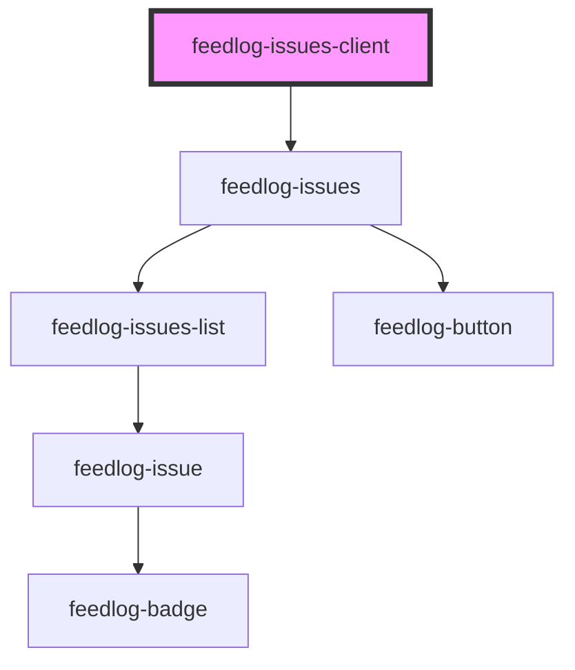

# feedlog-issues-client

## Styling

Set `--feedlog-*` on this element or a wrapper; custom properties inherit through shadow DOM into `feedlog-issues` and issue cards. See [Customize Feedlog styling](../../../../../docs/CUSTOMIZE_FEEDLOG_STYLING.md) and [feedlog-issue readme](../feedlog-issue/readme.md#css-customization).

<!-- Auto Generated Below -->

## Overview

Feedlog Issues Client Component

A component for displaying issues fetched using the Feedlog SDK.
This component uses the SDK internally to fetch data and delegates to feedlog-issues for rendering.

## Properties

| Property              | Attribute             | Description                                                                                                                                           | Type                                                                  | Default       |
| --------------------- | --------------------- | ----------------------------------------------------------------------------------------------------------------------------------------------------- | --------------------------------------------------------------------- | ------------- |
| `apiKey` _(required)_ | `api-key`             | Set via JS property only; not reflected to an HTML attribute (see Stencil `reflect`).                                                                 | `string`                                                              | `undefined`   |
| `emptyStateMessage`   | `empty-state-message` | Empty state message (e.g. "Check back later for new updates.")                                                                                        | `string \| undefined`                                                 | `undefined`   |
| `emptyStateTitle`     | `empty-state-title`   | Empty state title (e.g. "No updates yet")                                                                                                             | `string \| undefined`                                                 | `undefined`   |
| `endpoint`            | `endpoint`            | Custom API endpoint                                                                                                                                   | `string \| undefined`                                                 | `undefined`   |
| `getIssueUrl`         | --                    | Optional callback to resolve issue URL when githubIssueLink is not available. Required because repository.owner was removed from the API for privacy. | `((issue: FeedlogIssue) => string \| null \| undefined) \| undefined` | `undefined`   |
| `heading`             | `heading`             | Custom heading for the issues section                                                                                                                 | `string \| undefined`                                                 | `undefined`   |
| `limit`               | `limit`               | Maximum number of issues per page (1-100, default 10)                                                                                                 | `number \| undefined`                                                 | `undefined`   |
| `loadMoreLabel`       | `load-more-label`     | Label for the load-more button (load-more pagination mode only).                                                                                      | `string`                                                              | `'Load More'` |
| `maxWidth`            | `max-width`           | Maximum width of the container                                                                                                                        | `string`                                                              | `'42rem'`     |
| `minSkeletonTime`     | `min-skeleton-time`   | Minimum time in ms to display skeleton placeholders before replacing with real data. Prevents flickering on fast networks.                            | `number`                                                              | `250`         |
| `paginationType`      | `pagination-type`     | Pagination strategy: 'load-more' appends issues with a button, 'prev-next' shows prev/next arrow navigation with prefetching.                         | `"load-more" \| "prev-next"`                                          | `'load-more'` |
| `sortBy`              | `sort-by`             | Sort issues by field: 'createdAt' or 'updatedAt'                                                                                                      | `"createdAt" \| "updatedAt" \| undefined`                             | `undefined`   |
| `subtitle`            | `subtitle`            | Custom subtitle for the issues section                                                                                                                | `string \| undefined`                                                 | `undefined`   |
| `theme`               | `theme`               | Theme variant: 'light' or 'dark'                                                                                                                      | `"dark" \| "light"`                                                   | `'light'`     |
| `type`                | `type`                | Filter issues by type: 'bug' or 'enhancement'                                                                                                         | `"bug" \| "enhancement" \| undefined`                                 | `undefined`   |

## Events

| Event           | Description                            | Type                                                                       |
| --------------- | -------------------------------------- | -------------------------------------------------------------------------- |
| `feedlogError`  | Event emitted on error                 | `CustomEvent<{ error: string; code?: number \| undefined; }>`              |
| `feedlogUpvote` | Event emitted when an issue is upvoted | `CustomEvent<{ issueId: string; upvoted: boolean; upvoteCount: number; }>` |

## Dependencies

### Depends on

- [feedlog-issues](../feedlog-issues)

### Graph

---

_Built with [StencilJS](https://stenciljs.com/)_
