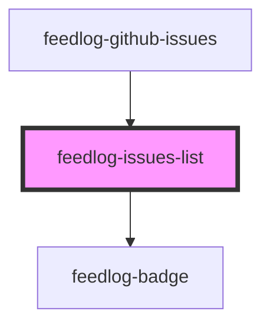

# feedlog-issues-list

<!-- Auto Generated Below -->

## Overview

Feedlog Issues List Component

A component for displaying a list of GitHub issues with support for bugs and enhancements.

## Properties

| Property | Attribute | Description                      | Type                | Default   |
| -------- | --------- | -------------------------------- | ------------------- | --------- |
| `issues` | --        | Array of issues to display       | `FeedlogIssue[]`    | `[]`      |
| `theme`  | `theme`   | Theme variant: 'light' or 'dark' | `"dark" \| "light"` | `'light'` |

## Events

| Event           | Description                            | Type                                                                               |
| --------------- | -------------------------------------- | ---------------------------------------------------------------------------------- |
| `feedlogUpvote` | Event emitted when an issue is upvoted | `CustomEvent<{ issueId: string; currentUpvoted: boolean; currentCount: number; }>` |

## Dependencies

### Used by

 - [feedlog-github-issues](../feedlog-github-issues)

### Depends on

- [feedlog-badge](../feedlog-badge)

### Graph

----------------------------------------------

*Built with [StencilJS](https://stenciljs.com/)*
