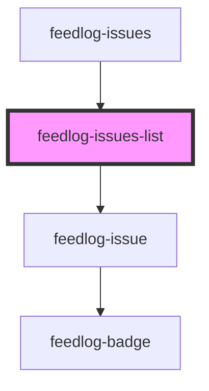

# feedlog-issues-list

<!-- Auto Generated Below -->

## Overview

Feedlog Issues List Component

A component for displaying a list of GitHub issues with support for bugs and enhancements.

## Properties

| Property            | Attribute             | Description                                                                                            | Type                                                                  | Default     |
| ------------------- | --------------------- | ------------------------------------------------------------------------------------------------------ | --------------------------------------------------------------------- | ----------- |
| `emptyStateMessage` | `empty-state-message` | Empty state message. When provided with emptyStateTitle, shows a richer empty state with illustration. | `string \| undefined`                                                 | `undefined` |
| `emptyStateTitle`   | `empty-state-title`   | Empty state title. When provided with emptyStateMessage, shows a richer empty state with illustration. | `string \| undefined`                                                 | `undefined` |
| `getIssueUrl`       | --                    | Optional callback to resolve GitHub issue URL when githubIssueLink is not available.                   | `((issue: FeedlogIssue) => string \| null \| undefined) \| undefined` | `undefined` |
| `issues`            | --                    | Array of issues to display                                                                             | `FeedlogIssue[]`                                                      | `[]`        |
| `theme`             | `theme`               | Theme variant: 'light' or 'dark'                                                                       | `"dark" \| "light"`                                                   | `'light'`   |

## Events

| Event           | Description                      | Type                                                                               |
| --------------- | -------------------------------- | ---------------------------------------------------------------------------------- |
| `feedlogUpvote` | Emitted when an issue is upvoted | `CustomEvent<{ issueId: string; currentUpvoted: boolean; currentCount: number; }>` |

## Dependencies

### Used by

- [feedlog-issues](../feedlog-issues)

### Depends on

- [feedlog-issue](../feedlog-issue)

### Graph

---

_Built with [StencilJS](https://stenciljs.com/)_
