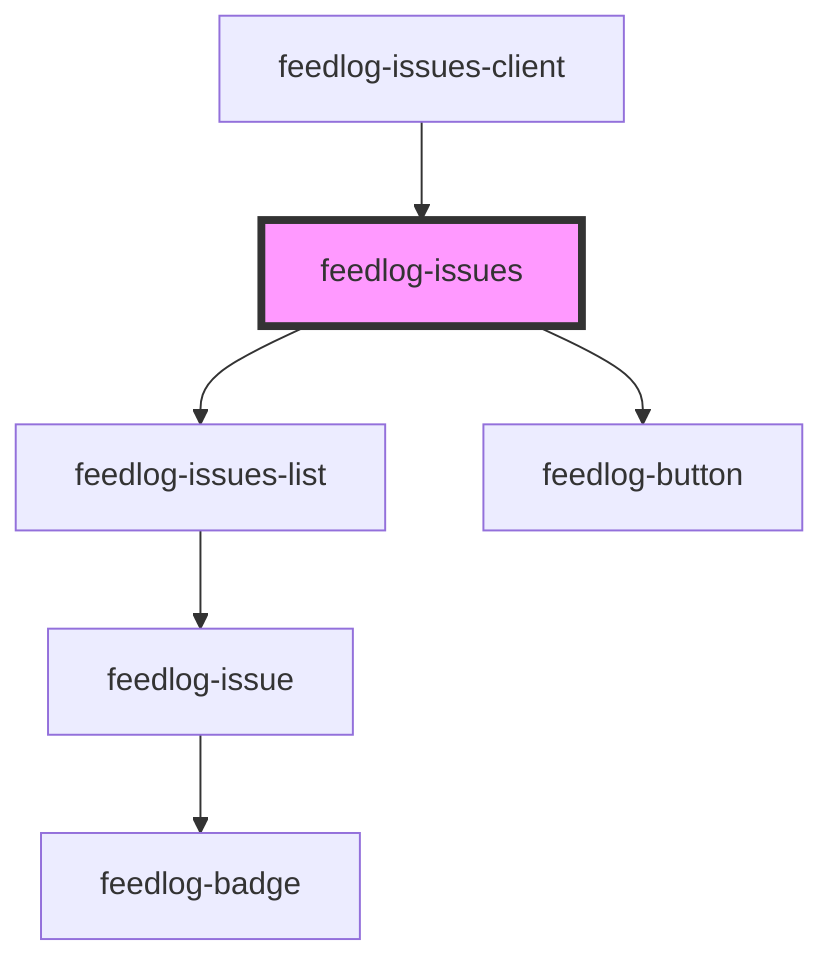

# feedlog-issues

<!-- Auto Generated Below -->

## Overview

Feedlog Issues Component

Component for displaying issues with support for bugs and enhancements.
Includes full list rendering, loading/error states, and pagination support.

## Properties

| Property            | Attribute             | Description                                                                                                                                           | Type                                                                  | Default     |
| ------------------- | --------------------- | ----------------------------------------------------------------------------------------------------------------------------------------------------- | --------------------------------------------------------------------- | ----------- |
| `emptyStateMessage` | `empty-state-message` | Empty state message. Defaults to "Check back later for new updates.".                                                                                 | `string \| undefined`                                                 | `undefined` |
| `emptyStateTitle`   | `empty-state-title`   | Empty state title. Defaults to "No updates yet".                                                                                                      | `string \| undefined`                                                 | `undefined` |
| `error`             | `error`               | Error message - shows error state when set                                                                                                            | `null \| string`                                                      | `null`      |
| `getIssueUrl`       | --                    | Optional callback to resolve issue URL when githubIssueLink is not available. Required because repository.owner was removed from the API for privacy. | `((issue: FeedlogIssue) => string \| null \| undefined) \| undefined` | `undefined` |
| `hasMore`           | `has-more`            | Whether there are more issues to load                                                                                                                 | `boolean`                                                             | `false`     |
| `heading`           | `heading`             | Custom heading for the issues section                                                                                                                 | `string \| undefined`                                                 | `undefined` |
| `isLoadingMore`     | `is-loading-more`     | Whether more issues are currently loading                                                                                                             | `boolean`                                                             | `false`     |
| `issues`            | --                    | Array of issues to display                                                                                                                            | `FeedlogIssue[]`                                                      | `[]`        |
| `limit`             | `limit`               | Page size for issues list pagination. When set, enables pagination when issues exceed this limit.                                                     | `number \| undefined`                                                 | `undefined` |
| `loading`           | `loading`             | Loading state - shows loading indicator when true                                                                                                     | `boolean`                                                             | `false`     |
| `maxWidth`          | `max-width`           | Maximum width of the container                                                                                                                        | `string`                                                              | `'42rem'`   |
| `subtitle`          | `subtitle`            | Custom subtitle for the issues section                                                                                                                | `string \| undefined`                                                 | `undefined` |
| `theme`             | `theme`               | Theme variant: 'light' or 'dark'                                                                                                                      | `"dark" \| "light"`                                                   | `'light'`   |

## Events

| Event             | Description                            | Type                                                                               |
| ----------------- | -------------------------------------- | ---------------------------------------------------------------------------------- |
| `feedlogLoadMore` | Event emitted to load more issues      | `CustomEvent<void>`                                                                |
| `feedlogUpvote`   | Event emitted when an issue is upvoted | `CustomEvent<{ issueId: string; currentUpvoted: boolean; currentCount: number; }>` |

## Dependencies

### Used by

- [feedlog-issues-client](../feedlog-issues-client)

### Depends on

- [feedlog-issues-list](../feedlog-issues-list)
- [feedlog-button](../feedlog-button)

### Graph

---

_Built with [StencilJS](https://stenciljs.com/)_
