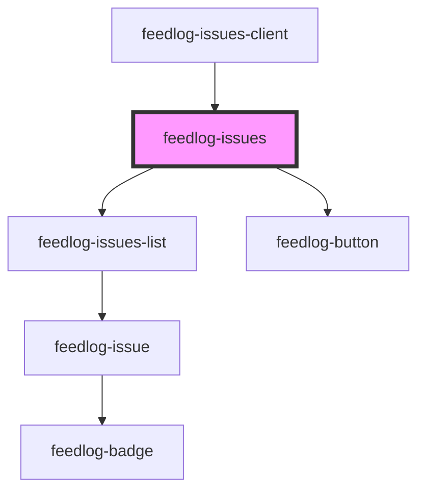

# feedlog-issues

## Styling

Container and list chrome tokens are set on `:host` in [`feedlog-issues.css`](./feedlog-issues.css). Override `--feedlog-*` on `feedlog-issues` or `feedlog-issues-client` (or an ancestor). Full reference: [Customize Feedlog styling](../../../../../docs/CUSTOMIZE_FEEDLOG_STYLING.md). Per-issue card and upvote variables: [feedlog-issue readme](../feedlog-issue/readme.md#css-customization).

<!-- Auto Generated Below -->

## Overview

Feedlog Issues Component

Component for displaying issues with support for bugs and enhancements.
Includes full list rendering, loading/error states, and pagination support.

## Properties

| Property            | Attribute             | Description                                                                                                                                           | Type                                                                  | Default       |
| ------------------- | --------------------- | ----------------------------------------------------------------------------------------------------------------------------------------------------- | --------------------------------------------------------------------- | ------------- |
| `emptyStateMessage` | `empty-state-message` | Empty state message. Defaults to "Check back later for the latest news and updates.".                                                                 | `string \| undefined`                                                 | `undefined`   |
| `emptyStateTitle`   | `empty-state-title`   | Empty state title. Defaults to "Nothing to see here".                                                                                                 | `string \| undefined`                                                 | `undefined`   |
| `error`             | `error`               | Error message - shows error state when set                                                                                                            | `null \| string`                                                      | `null`        |
| `getIssueUrl`       | --                    | Optional callback to resolve issue URL when githubIssueLink is not available. Required because repository.owner was removed from the API for privacy. | `((issue: FeedlogIssue) => string \| null \| undefined) \| undefined` | `undefined`   |
| `hasMore`           | `has-more`            | Whether there are more issues available (controls Next button / Load More visibility)                                                                 | `boolean`                                                             | `false`       |
| `hasPrev`           | `has-prev`            | Whether a previous page is available (for prev-next mode)                                                                                             | `boolean`                                                             | `false`       |
| `heading`           | `heading`             | Custom heading for the issues section                                                                                                                 | `string \| undefined`                                                 | `undefined`   |
| `isLoadingMore`     | `is-loading-more`     | Whether more issues are currently loading                                                                                                             | `boolean`                                                             | `false`       |
| `issues`            | --                    | Array of issues to display                                                                                                                            | `FeedlogIssue[]`                                                      | `[]`          |
| `limit`             | `limit`               | Number of items per page. Used to determine skeleton count during load-more.                                                                          | `number \| undefined`                                                 | `undefined`   |
| `loading`           | `loading`             | Loading state - shows loading indicator when true                                                                                                     | `boolean`                                                             | `false`       |
| `maxWidth`          | `max-width`           | Maximum width of the container                                                                                                                        | `string`                                                              | `'42rem'`     |
| `paginationType`    | `pagination-type`     | Pagination strategy: 'load-more' appends issues with a button, 'prev-next' shows prev/next arrow navigation.                                          | `"load-more" \| "prev-next"`                                          | `'load-more'` |
| `subtitle`          | `subtitle`            | Custom subtitle for the issues section                                                                                                                | `string \| undefined`                                                 | `undefined`   |
| `theme`             | `theme`               | Theme variant: 'light' or 'dark'                                                                                                                      | `"dark" \| "light"`                                                   | `'light'`     |

## Events

| Event               | Description                                                 | Type                                                                       |
| ------------------- | ----------------------------------------------------------- | -------------------------------------------------------------------------- |
| `feedlogLoadMore`   | Event emitted to load more issues (load-more mode)          | `CustomEvent<void>`                                                        |
| `feedlogPageChange` | Event emitted when navigating pages (prev-next mode)        | `CustomEvent<{ direction: "prev" \| "next"; }>`                            |
| `feedlogRetry`      | Event emitted when the user clicks retry on the error state | `CustomEvent<void>`                                                        |
| `feedlogUpvote`     | Event emitted when an issue is upvoted                      | `CustomEvent<{ issueId: string; upvoted: boolean; upvoteCount: number; }>` |

## Dependencies

### Used by

- [feedlog-issues-client](../feedlog-issues-client)

### Depends on

- [feedlog-issues-list](../feedlog-issues-list)
- [feedlog-button](../feedlog-button)

### Graph

```mermaid
graph TD;
  feedlog-issues --> feedlog-issues-list
  feedlog-issues --> feedlog-button
  feedlog-issues-list --> feedlog-issue
  feedlog-issue --> feedlog-badge
  feedlog-issues-client --> feedlog-issues
  style feedlog-issues fill:#f9f,stroke:#333,stroke-width:4px
```

---

_Built with [StencilJS](https://stenciljs.com/)_
